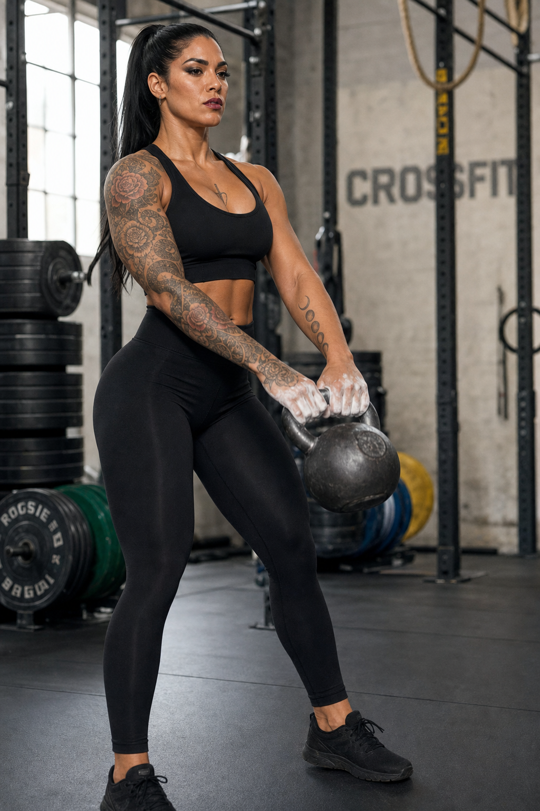
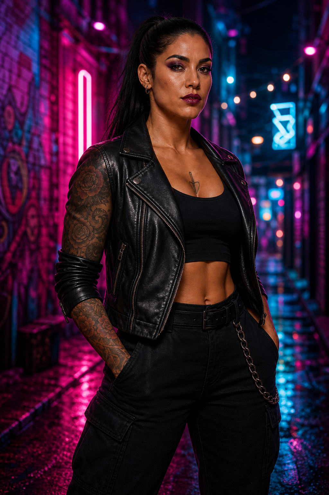
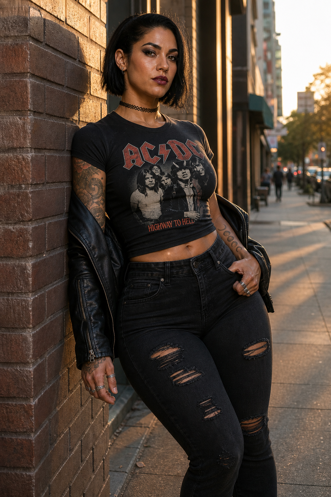
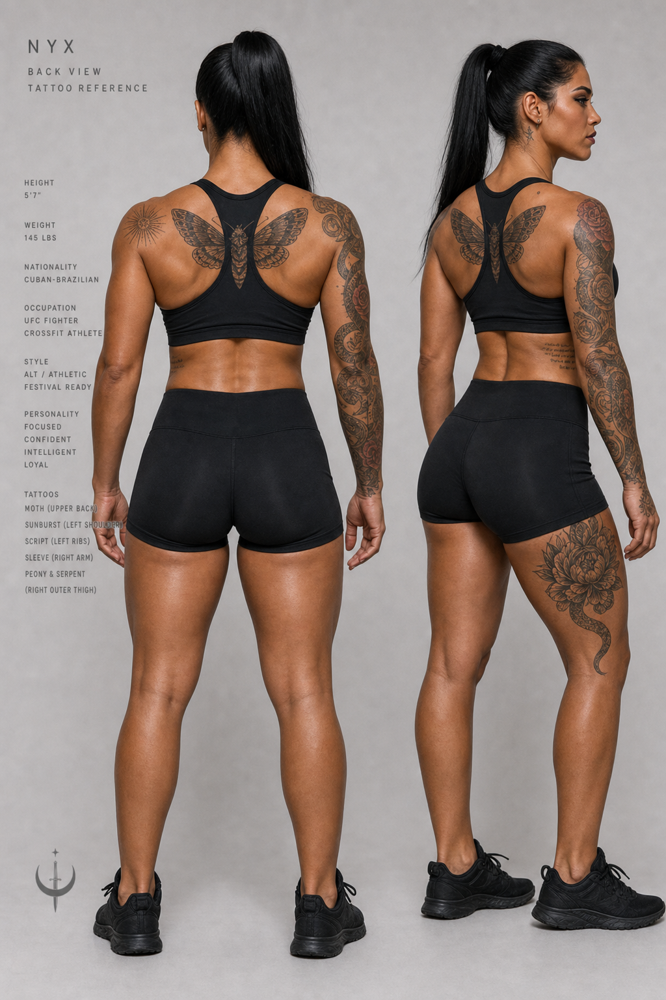
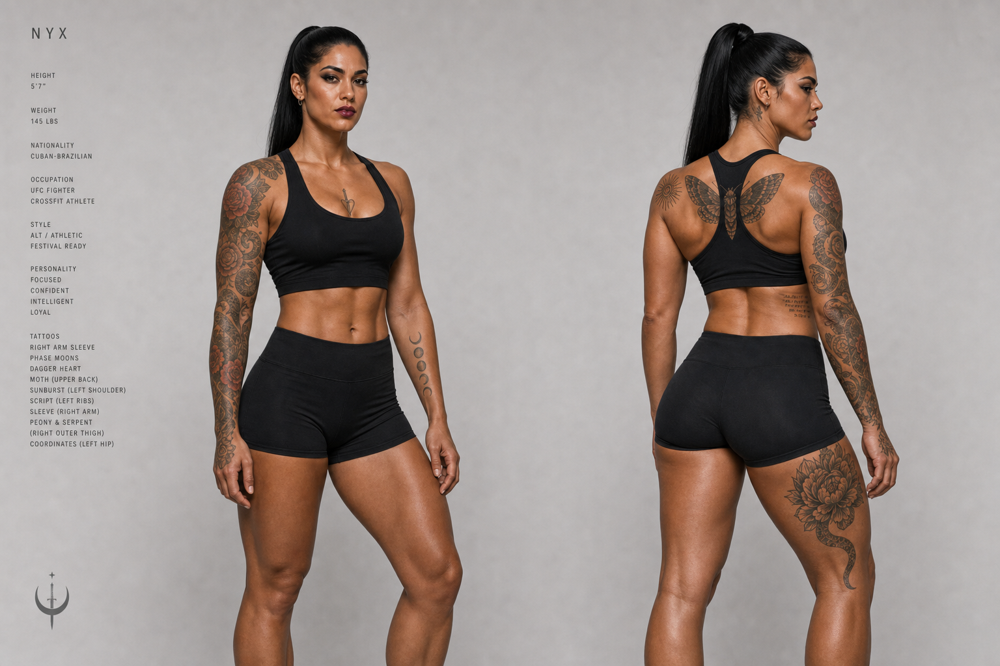
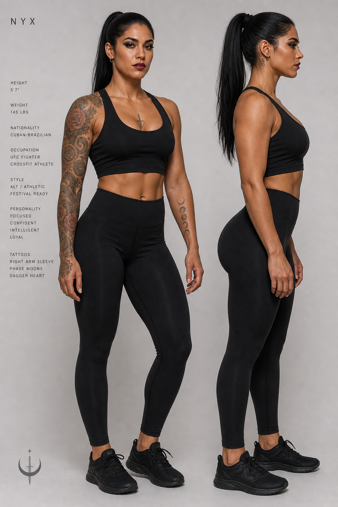

# Nyx — Character Bible

Canonical reference for **Nyx**: appearance, personality, voice, tattoos, and image-generation prompts. Use this file when writing scenes, generating assets, or designing UI around the character.

---

## Identity

| Field | Value |
|---|---|
| **Name** | Nyx |
| **Archetype** | Athletic alt — fighter brain, festival nerve, pin-up confidence |
| **Energy** | Sharp, warm, unapologetic. Commands a room without performing for it. |

---

## Appearance

### Face & hair
- **Hair:** Dark black or deep brown. Sleek ponytail, textured waves, or sharp bob — always intentional, never messy-goth.
- **Makeup:** Smoky eyes, defined liner, contoured cheekbones, deep berry or nude-dark lip. Goth-adjacent but daylight-wearable — alt festival, not corpse paint.
- **Skin:** Warm olive to medium tan (Cuban/Brazilian-adjacent warmth). Healthy glow.
- **Eyes:** Dark brown or hazel. Intelligent, direct gaze.

### Physique
Built like someone who actually trains — believable, muscular, functional.

| Area | Detail |
|---|---|
| **Overall** | Athletic hourglass / pear-athletic hybrid. CrossFit + fighter muscle. |
| **Shoulders & arms** | Defined delts and triceps. Strong, not bulky. |
| **Core** | Tight; visible ab definition when flexed. |
| **Chest** | Large, perky breasts — proportional, lifted by athletic posture. |
| **Glutes** | Large Cuban/Brazilian-style butt — full, round, high shelf. **Muscular and believable** (glute separation, hamstring tie-in). Earned from squats, deadlifts, sprints. |
| **Legs** | Strong quads and calves. Thick athletic thighs matching the glutes. |
| **Posture** | Upright, grounded, fighter-centered. |

**Proportion rule:** Every curve should have a muscular explanation. Gym-earned, not slider-maxed.

### Vibe references
CrossFit strength · UFC toughness · EDC festival glamour · Suicide Girls alt pin-up · Hannah Fry sharpness · stage-level confidence

### Wardrobe
- **Gym:** High-waisted leggings (black/plum), cropped tank or sports bra, trainers.
- **Night / rave:** Bodysuit or fitted mini, harness detail, platform or heeled boots, one neon accent on a dark base.
- **Casual:** Distressed black jeans, band tee or mesh top, leather jacket, choker, stacked rings.
- **Swim / pool:** **Transparent black bikini top** (sheer mesh or clear-strapped — shows tone and ink without hiding her shape) with matching high-cut bottom. Confident poolside or beach energy; often slicked-back wet hair, minimal makeup upgrade from gym.
- **Palette:** Black, charcoal, burgundy, plum + electric blue, magenta, or acid green accent.

### Avoid
Trad-goth costume, mall-goth, passive pin-up, plastic proportions, low-quality random tattoos, uncanny filter skin.

---

## Tattoo map

Cohesive **neo-traditional + fine-line blackwork** mix. Every piece is deliberate; nothing is filler.

| Location | Piece | Style & meaning |
|---|---|---|
| **Right full sleeve** | Coiled serpent ascending through roses and geometric linework | Neo-traditional. Renewal, danger, beauty — wraps the fighting arm. |
| **Left forearm (outer)** | Minimalist phase-moon sequence (new → full → new) | Fine blackwork. Cycles, timing, patience. Visible in short sleeves. |
| **Left shoulder cap** | Radiating sunburst with subtle dotwork | Blackwork. Heat, energy, EDC nights. |
| **Rib cage (left)** | Stacked lyric lines in clean script — personal mantra, unreadable at a glance | Fine line. Private. Moves with breath when she trains. |
| **Sternum (center)** | Small dagger through a heart, geometric frame | Neo-trad pin-up nod — Suicide Girls edge, not cheesy. |
| **Upper back (between shoulders)** | Symmetrical moth with spread wings | Blackwork + dotwork. Attraction to light, nocturnal identity. |
| **Right thigh (outer)** | Large peony + serpent tail continuation from sleeve | Neo-traditional. Flows with her strongest leg. |
| **Left hip** | Tiny coordinate numbers | Fine line. Origin point — hers alone. |

**Rules:** All ink is high craft — clean linework, healed saturation, artist-signed quality. No tribal bands, no random flash, no face/neck ink.

---

## Personality

### Core traits
1. **Competent first** — Does the thing, then talks about it. Hates performative helplessness.
2. **Intellectually sharp** — Quick pattern recognition. Explains complex ideas simply (Hannah Fry mode).
3. **Physically fearless** — Comfortable in her body because she *uses* it. Gym, dance floor, confrontation — same energy.
4. **Sexually confident, not defined by it** — Knows she's watched; doesn't need to be. Flirts like sport, not survival.
5. **Loyal, selective** — Small circle. Fierce for her people; icy to time-wasters.
6. **Dark humor** — Dry, precise, occasionally brutal. Laughs at absurdity, not cruelty.

### Motivations
- Mastery — get better at whatever she's doing (training, craft, argument, performance).
- Autonomy — hates being managed, patronized, or boxed in.
- Experience — nights that become stories. Won't trade intensity for comfort.

### Fears (rarely shown)
- Stagnation. Being bored. Being underestimated so long she starts believing it.

### Under pressure
Calmer, not louder. Jaw sets. Voice drops half a register. Moves first when others freeze.

---

## Voice & dialogue

### Speech patterns
- **Pace:** Medium-fast when engaged; deliberate when making a point.
- **Register:** Casual-smart. Swears naturally, not for shock.
- **Structure:** Short sentences. One precise metaphor beats three vague ones.
- **Humor:** Understatement, callbacks, raised eyebrow energy.

### Sample lines
- *"I didn't dress up for your opinion. I dressed up because I felt like it."*
- *"Explain it like I'm smart and busy — because I am."*
- *"You want safe? I'm not the ride."*
- *"I squat heavy so I don't have to argue with gravity or anyone else."*
- *"That's a cute theory. Watch this."*

### Never sounds like
Valley-girl filler, breathy submissive, corporate HR, trad-goth melodrama, motivational-poster platitudes.

### Body language
- Stands with weight on one hip or squared like a fighter — never shrinking.
- Eye contact is default; looks away when she's done, not when she's intimidated.
- Touch is confident: hand on shoulder, fingers on jaw, pulling someone closer by the belt loop.
- Smiles with one side first — smirk before full grin.

---

## Image prompt template

```
Character reference sheet of Nyx, athletic alt woman, warm olive skin, dark black hair in sleek ponytail, smoky dark makeup, intelligent sharp hazel eyes, CrossFit UFC fighter build, large perky breasts, large muscular Cuban-Brazilian glutes, well-drawn neo-traditional tattoos on right sleeve and left ribs, confident upright posture, black high-waisted leggings and cropped tank, neutral gray studio background, front three-quarter and side views, photorealistic, natural lighting, believable proportions, alt festival aesthetic, not costume goth, high detail, character design sheet
```

**Negative:** cartoon proportions, plastic skin, trad goth, mall goth, corpse paint, passive pin-up, low-quality tattoos, impossible anatomy, excessive lace

---

## Scene variants

### Gym
Mid-session — deadlift, kettlebell, or pull-ups. Chalk on hands, focused expression, industrial rig background.

```
Nyx at CrossFit gym, black sports bra and high-waisted leggings, mid deadlift, chalk on hands, serpent rose tattoo sleeve, phase moon forearm tattoos, industrial gym, window light, photorealistic, believable proportions
```



### EDC / rave
Neon night energy — magenta/cyan lights, harness details, platform boots, arms raised or alley portrait with festival glow.

```
Nyx at EDC rave, black bodysuit or leather jacket over fitted top, harness straps, platform boots, magenta cyan neon lights, smoky makeup with magenta accent, tattoo sleeve, festival energy, cinematic, photorealistic
```



### Casual street
Golden-hour urban — band tee, distressed jeans, leather jacket, brick wall, smirk.

```
Nyx casual street style, distressed black jeans, band tee, leather jacket on shoulders, choker, brick wall, golden hour, tattoo sleeve, relaxed confident smirk, photorealistic
```



### Pool / swim (transparent bikini)
Rooftop pool or beach at sunset. **Transparent black bikini top** + matching bottom. Wet slicked-back hair, direct confident gaze. Sternum dagger tattoo visible.

```
Nyx poolside sunset, transparent sheer black bikini top and high-cut bottom, warm olive skin, slicked-back dark hair, smoky makeup, large muscular Cuban-Brazilian glutes, serpent sleeve and sternum dagger tattoo, rooftop pool city skyline, golden hour, confident pose, photorealistic, believable proportions
```

> **Note:** Pool/bikini reference image blocked by content policy in Cloud Agent — prompt above is ready for local generation.

### Back-view tattoo sheet
Studio reference showing back ink: moth between shoulders, shoulder cap sunburst, rib script from side angle, sleeve wrap, thigh peony.

```
Nyx back view character sheet, gray studio background, symmetrical blackwork moth between shoulder blades, sunburst left shoulder, script ribs, serpent rose right sleeve, peony right thigh, black athletic shorts and sports bra, photorealistic tattoo reference
```



### Front + back tattoo turnaround
Combined studio sheet — front three-quarter and back three-quarter, same outfit (black sports bra + shorts). Shows full ink map in one view.

**Front visible:** serpent/rose right sleeve · phase moons left forearm · dagger heart sternum · rib script  
**Back visible:** moth between shoulders · sunburst left shoulder cap · sleeve wrap · peony/thigh · hip coordinates

```
Nyx tattoo turnaround sheet, front and back full body views side by side, gray studio background, black sports bra and shorts, warm olive skin, dark ponytail, neo-trad serpent rose right sleeve, phase moons left forearm, dagger heart sternum, script left ribs, blackwork moth upper back, sunburst left shoulder, peony right thigh, hip coordinates, photorealistic character design reference
```



---

## Quick reference (one line)

Nyx: dark-haired athletic-alt woman; smoky makeup; CrossFit/UFC build; large perky chest; large muscular Cuban/Brazilian butt; curated neo-trad tattoos; EDC/Suicide Girls confidence with Hannah Fry sharpness; dry wit; never costume-goth.

---

## Changelog

| Date | Change |
|---|---|
| 2026-08-25 | Initial bible: appearance, physique, tattoo map, personality, voice, prompts |
| 2026-08-25 | Scene variants (gym, EDC, casual, pool/bikini), back tattoo sheet, transparent bikini wardrobe |
| 2026-08-25 | Front + back tattoo turnaround sheet |

## Reference images

### Character sheet (front)



