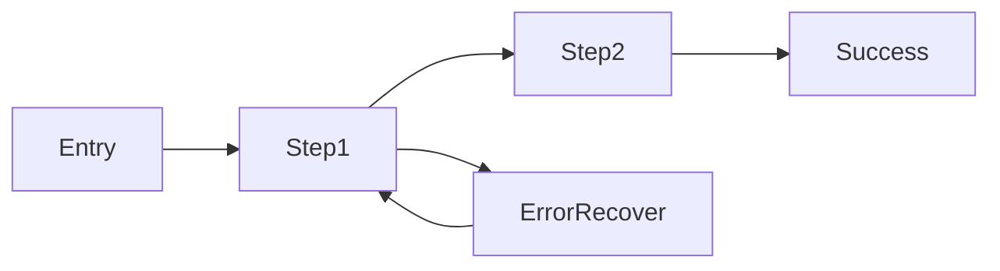

# UX engineering

**Goal:** The user completes their task with **clear feedback**, **recoverable errors**, and **no surprise** — not just a pretty static layout.

## Begin with the user outcome

From `deliverable-first`, answer:

1. **Who** is acting? (role, skill level, stress context)
2. **Job to be done** in one verb phrase ("pay invoice", "invite teammate")
3. **Success signal** — what do they see/hear when it worked?
4. **Failure modes** — what can go wrong and how do they recover?

If any answer is missing, the UX spec is incomplete.

## Four required UI states

Every data-driven surface implements all four:

| State | User need | Pattern |
|---|---|---|
| **Loading** | Know system is working | Skeleton matching layout; avoid spinner-only full page |
| **Empty** | Know what to do next | Explain why empty + primary CTA |
| **Error** | Recover without support | Plain language + retry + contact escape hatch |
| **Success** | Confirm outcome | Toast/banner/inline check; don't silently redirect |

Missing empty/error states are the most common UX defect in agent-generated UI.

## Heuristics (Nielsen — apply in review)

1. **Visibility of system status** — loading, saving, saved
2. **Match real world** — user vocabulary, not DB column names
3. **User control** — undo, cancel, confirm destructive
4. **Consistency** — same action, same label and placement
5. **Error prevention** — disable invalid submit; confirm delete
6. **Recognition over recall** — visible options, recent items
7. **Flexibility** — shortcuts for experts, simple path for novices
8. **Minimalist design** — remove noise (`clean-minimal-code` for UI)
9. **Help recover from errors** — specific messages, not "Something went wrong"
10. **Help and documentation** — contextual hints, not manual wall

## Accessibility (non-optional)

Minimum bar (WCAG 2.2 oriented):

- **Keyboard:** all flows operable without mouse; logical tab order
- **Focus:** visible focus ring; no `outline-none` without replacement
- **Color:** contrast ≥ 4.5:1 body text; don't convey state by color alone
- **Labels:** every input has `<label>` or `aria-label`; buttons describe action
- **Live regions:** `aria-live` for async success/error toasts
- **Motion:** respect `prefers-reduced-motion`

Run automated scan when available (`axe`, Playwright accessibility snapshot via `playwright-cli`); manual keyboard pass for critical flows.

## Forms UX

- Label above or beside field; placeholder is not a label
- Inline validation **after blur** or submit — not on every keystroke unless async check
- Disable submit while invalid **and** show why
- Preserve user input on server error
- Destructive actions: confirm + explain consequence

## Microcopy

| Bad | Better |
|---|---|
| Submit | Save changes |
| Error 500 | We couldn't save — try again or contact support |
| No data | No invoices yet — create your first invoice |
| OK | Got it |

## Flow diagram (before multi-step UI)

For ≥2 step flows, sketch:

Implement back navigation and deep-linkable steps where possible.

## Verify UX in real time

Pair with `real-time-testing`:

- Component tests for state rendering (empty/error)
- Playwright: keyboard tab through primary flow
- Screenshot only after functional checks pass (`walkthrough-artifacts` for demos)

## Handoffs

| Topic | Skill |
|---|---|
| JSX structure, tokens, shadcn | `ui-engineering` |
| End-to-end product verification | `verification` |
| Performance | `react-best-practices` |
